# Nguyễn Kiêm Mạnh 23010909  
# Hệ thống quản lý học viên 

## 👋 About Me  
Xin chào! Tôi là **Nguyễn Kiêm Mạnh_23010909**.
- 🌱 Hiện tại tôi đang học Laravel và phát triển các ứng dụng web.  
- 🚀 Repositories Dự án được cập nhật mới nhất tính đến thời điểm hiện tại: [Hệ thống quản lý học viên](https://github.com/lionelmahn/QLKhoaHoc)  
- 📫 Liên hệ:[Email](23010909@st.phenikaa-uni.edu.vn)  

---

## About my project
  Hệ thống quản lý học viên là một nền tảng trực tuyến đang được phát triển nhằm hỗ trợ các trung tâm đào tạo và trường học quản lý hiệu quả thông tin học viên và khóa học. Hệ thống cho phép theo dõi danh sách học viên, cập nhật thông tin cá nhân, quản lý quá trình đăng ký khóa học và sắp xếp lịch học một cách thuận tiện.

---

## ⚙️ Yêu cầu hệ thống  
- PHP 8.x  
- Composer  
- MySQL hoặc các hệ quản trị CSDL khác  
- Laravel  

---

🚀 Thiết lập
# 1️⃣ Clone repository
- git clone https://github.com/lionelmahn/QLKhoaHoc.git
- cd repository
# 2️⃣ Composer and Laravel:
- composer install
- cp .env.example .env
- php artisan key:generate
- composer create-project --prefer-dist laravel/laravel {ten_project}
# 3️⃣ Configure Database Settings:
- Setup file .env
# 4️⃣ Chạy migration và seed dữ liệu
- php artisan migrate --seed
# 5️⃣ Chạy ứng dụng (local)
- php artisan serve
---

# 🎯 Chức năng chính:
- Quản lý học viên (Thêm, sửa, xóa)
- Quản lý khóa học (Thêm, sửa, xóa khóa học, quản lý học viên tham gia khóa học)
# 📌 Trạng Thái Dự Án
## 🛠 Đang phát triển – Dự án vẫn đang trong quá trình xây dựng, các tính năng có thể thay đổi.
- 🚀 Repositories Dự án được cập nhật mới nhất tính đến thời điểm hiện tại: [Hệ thống quản lý học viên](https://github.com/lionelmahn/QLKhoaHoc)  
---
# 🔗 Truy cập ứng dụng
👉 [Mở ứng dụng tại đây](https://fantastic-train-v66q7gqr55qw3x5rj-8000.app.github.dev/)

👉 [Video demo](https://youtu.be/ZbF379UCdfc)
---
<h1>Class Diagram</h1>
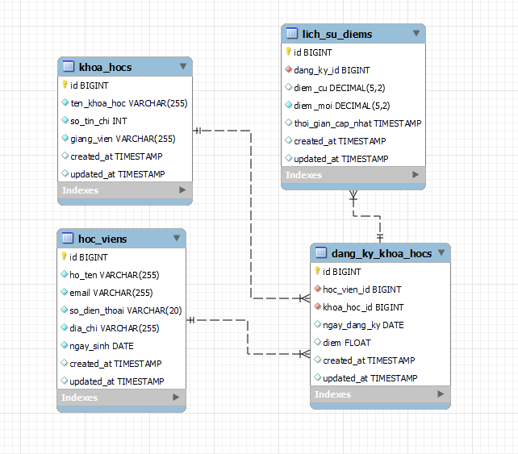
<h1>Use case</h1>
<h2>Case tổng quát</h2> 
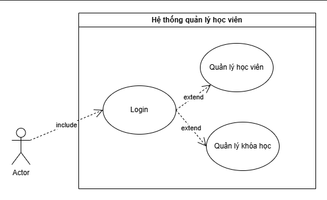
<h2>Use case Quản lý học viên</h2>
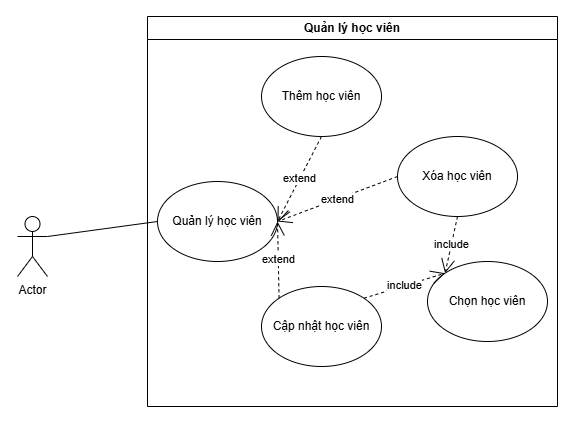
<h2>Use case Quản lý khóa học</h2>
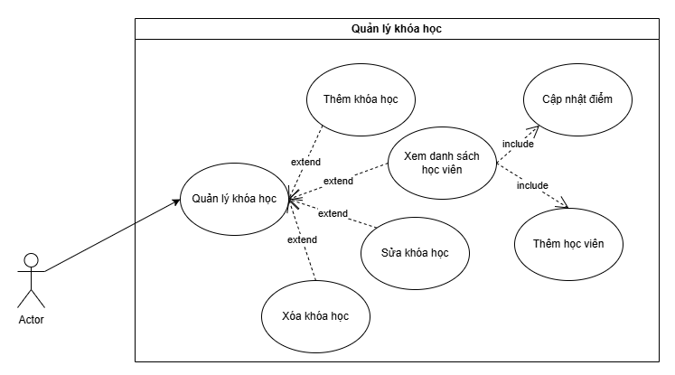
<h2>Biểu đồ tuần tự chức năng thêm</h2>
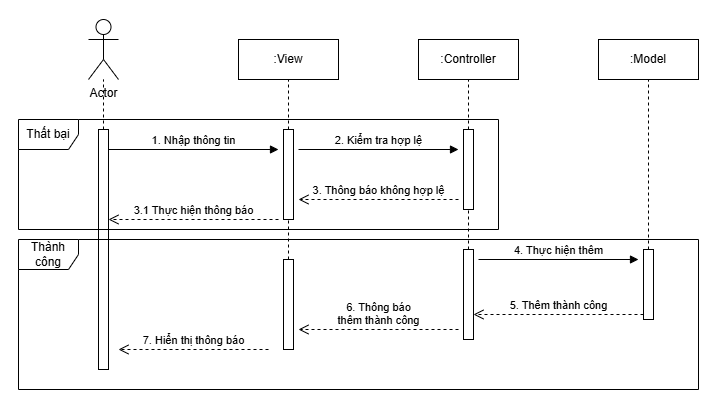
<h2>Biểu đồ tuần tự chức năng update</h2>
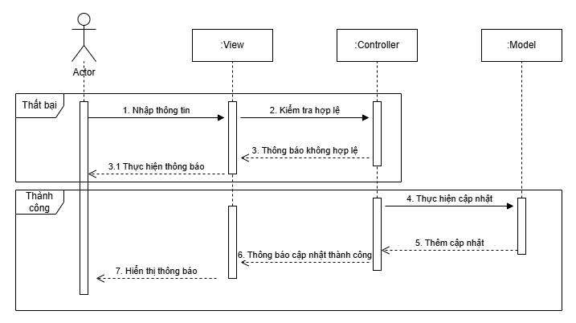
<h2>Biểu đổ tuần tự chức năng xóa</h2>
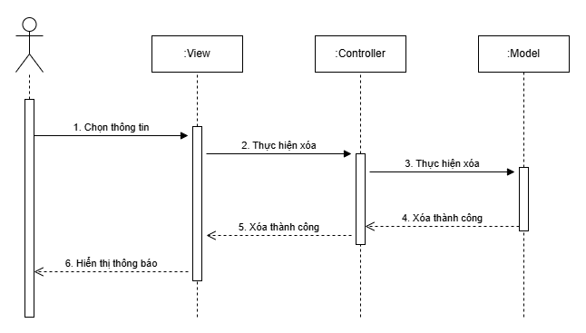
<h2>Biểu đồ hoạt động chức năng thêm</h2>
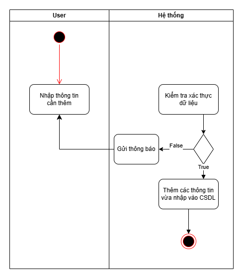
<h2>Biểu đồ hoạt động chức năng update</h2>
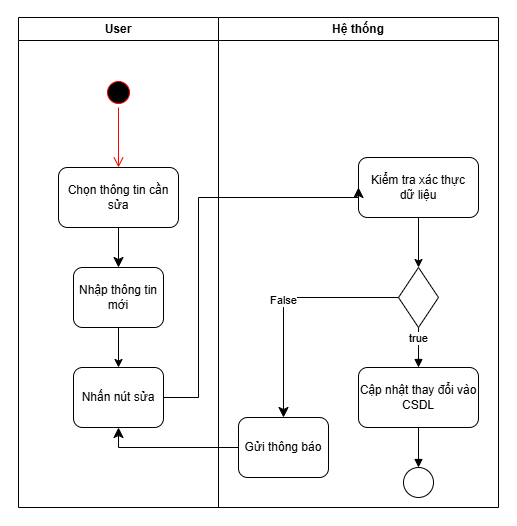
<h2>Biểu đồ hoạt động chức năng xóa</h2>
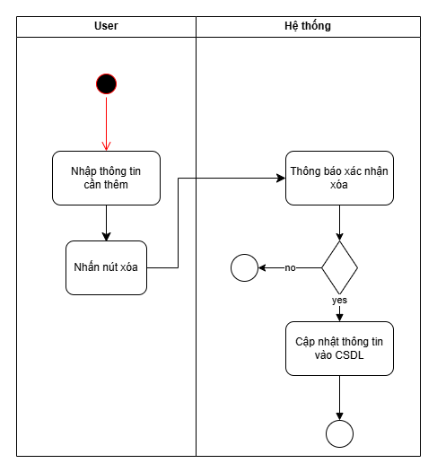

# Một vài hình ảnh demo về website
<h2>Waiting Page</h2>
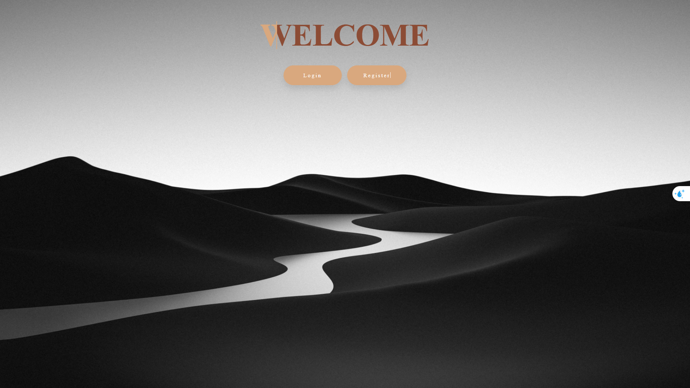
<h2>Đăng nhập</h2>
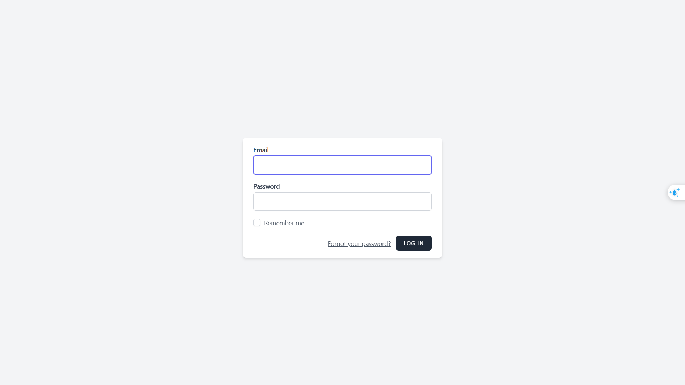
<h2>Đăng kí</h2>
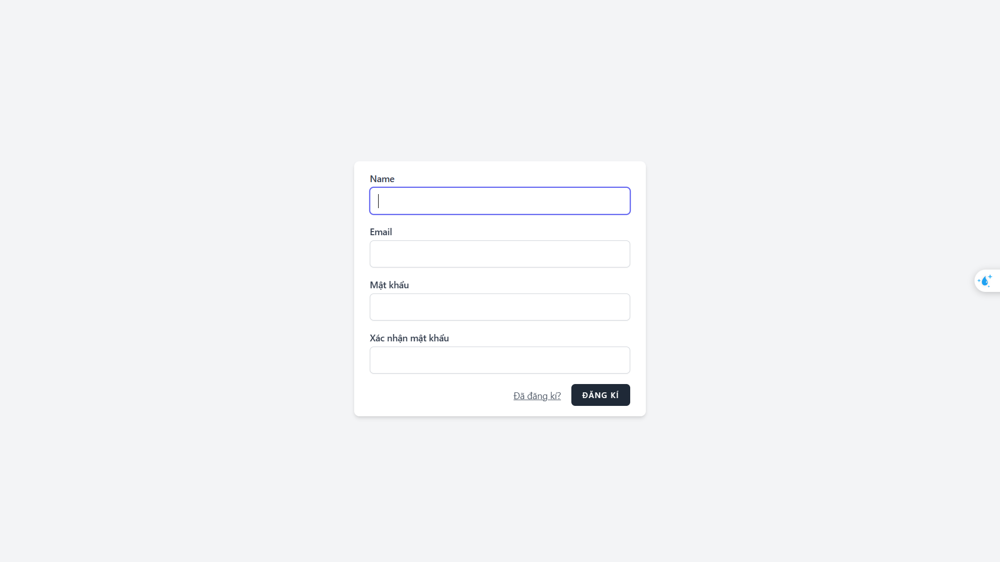
<h2>Dashboad</h2>
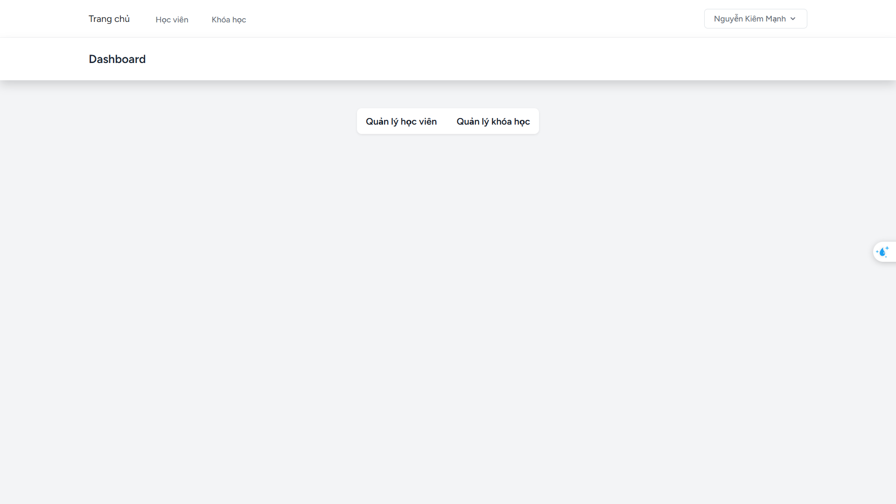
<h2>Danh sách học viên</h2>
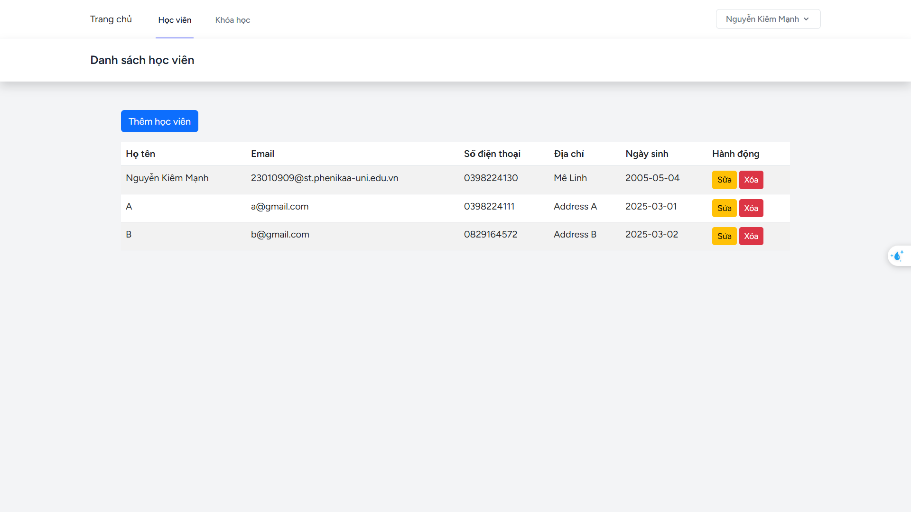
<h2>Thêm học viên</h2>
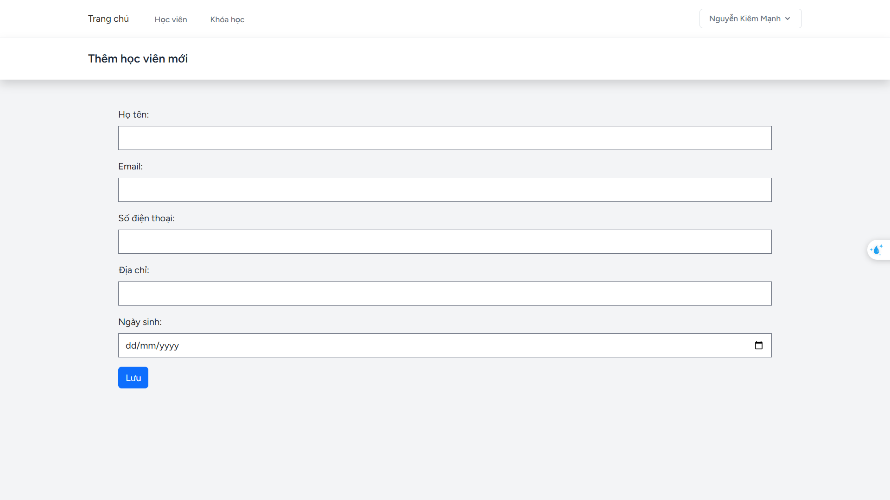
<h2>Update thông tin học viên</h2>
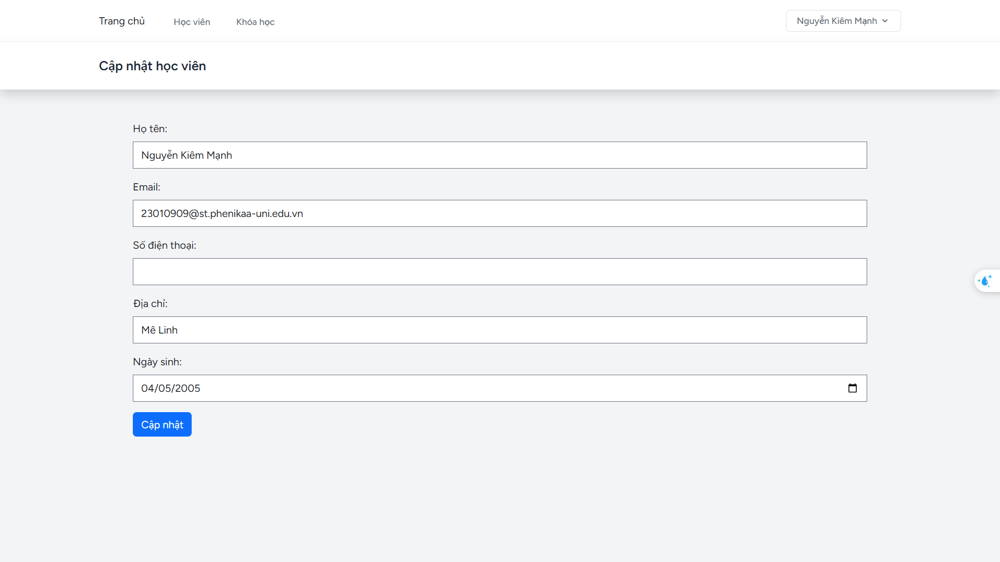
<h2>Delete học viên</h2>
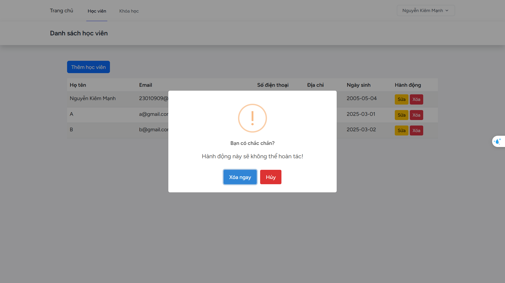
<h2>Thêm khóa học</h2>
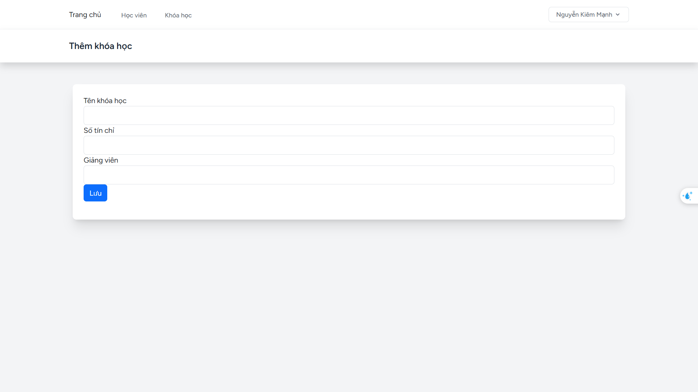
<h2>Update thông tin khóa học</h2>
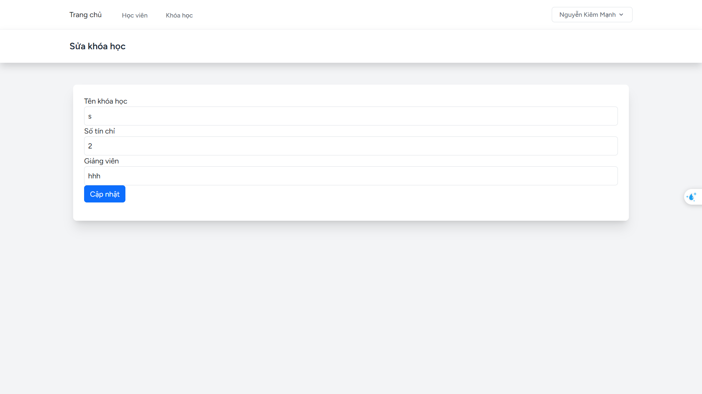
<h2>Delete khóa học</h2>
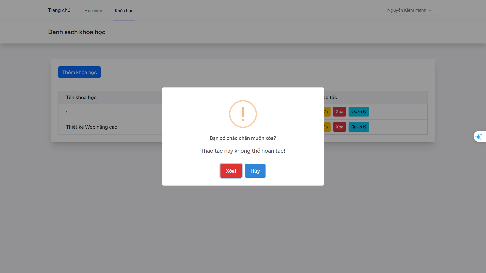
<h2>Thêm học viên vào khóa học</h2>
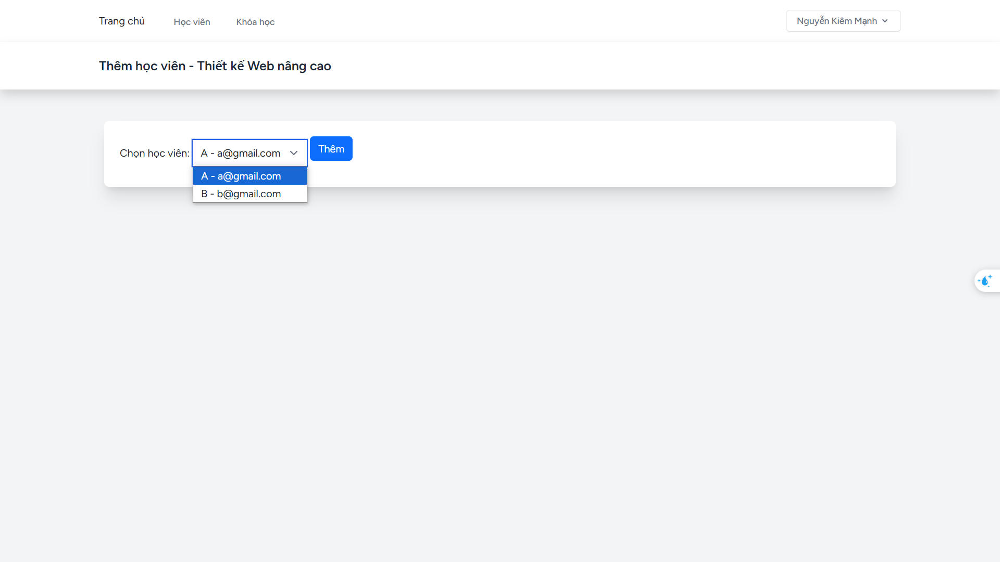
<h2>Danh sách học viên - Khóa học</h2>
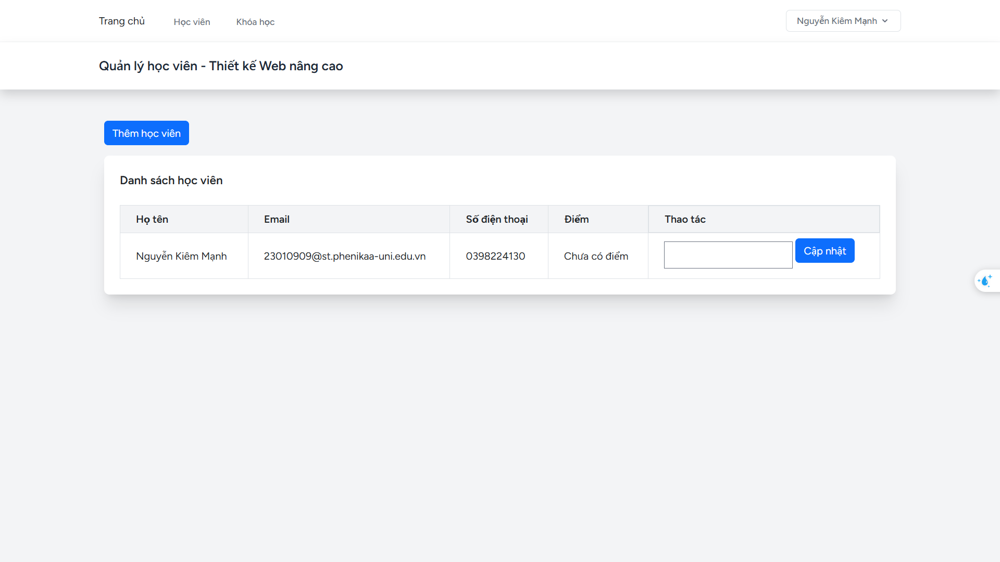
---

